# Product-Price-Prediction
**Team Members:** Jin Chen, Zhi Li, Juliana Ma, Zhiying Zhu

## **Motivation and Problem Description** 

Once an individual entering the retail industry, how can he/she quickly gain knowledge of the market? 
How could he/she scale a good price for his/her product? If he/she prices the products too high, customers will not be willing to purchase. 
If the prices are too low, the retailer will not make enough profit, customers will also doubt about the quality of the product. 
Besides the retailer, price prediction is also essential for business owner in understanding the market. Learning the
competitors' pricing decisons can help he/she to plan his/her business strategy. 
Therefore, there are two questions that we should ask before pricing. What would affect the price and how can the best price range be determined. 

There are some common knowledge about what could affect the price, such as season and brand. Moreover, the description of a product can also cause price fluctuation. 
To better understand these questions and explore the answers, we shall look into the dataset that is provided by [Mercari](https://www.mercari.com),  
Japan’s biggest community-powered shopping app. The dataset contains over 1.4 millions of product records, where each record
consists the seller inputted information of the product they are selling, including the item names, item conditions, 
brand names, item categories, shipping status, and item descriptions. 
There are many reasons that we can say that the dataset is great for us to explore the potential answers to our questions. 
First, online selling is more in demand nowadays and sellers not only sell the new product but also 
the remanufactured product or second-hand product online, and this dataset could see the products from a larger diverse range. 
Second, the range of sellers on Mercari could be from newcomers to experienced sellers, so we can have a more general analysis of the market.
Third, the dataset contains larger number of records that can provide a great significantly overview of the market. 

Based on the dataset, we would like to discover if item desciption or other fields that the dataset provides can really 
help people determine the price range of the product, and if so, how accurate that predict price range will be. 
To find the answer for our problem, we explored on different data processing, analysis algorithms and machine learning models 
to build the pipeline for our price prediction. The general pipeline of our process is shown below. The
color of each component reflects the work that was done by which team member. 

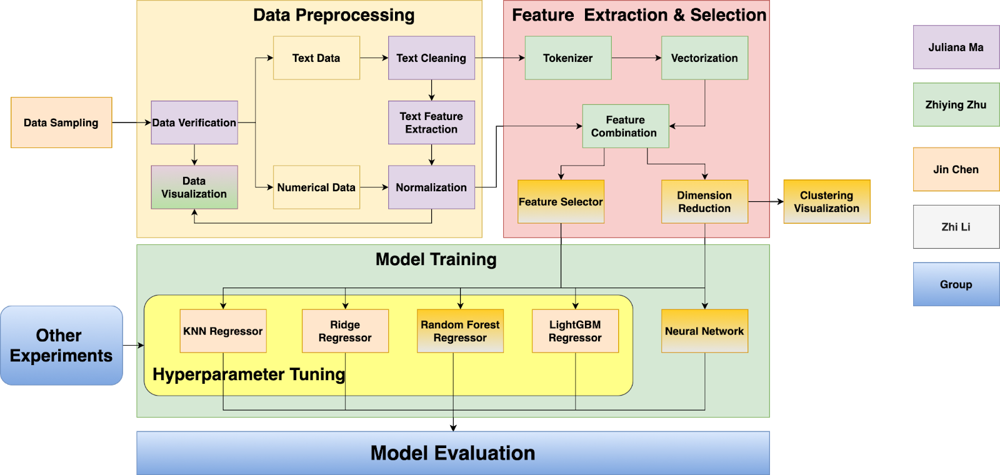

## Data Exploration and Preprocessing

None of the raw data is clean. In order to get meaningful insight from the dataset, we need to perform a series of steps 
for data cleaning and pre-processing. The full process for our EDA process is shown in the [EDA_Process.ipynb](./EDA_Process.ipynb).  

As the data that we collected are from sellers' manual input, they are prone to error. We applied
some logic to detect and remove the wrong records. For example, we have found 874 records with price less or equal to 
0, which we remove from dataset, because price cannot never be a negative value or 0. 

From the 8 attributes the dataset provide, train_id cannot be used so we did not perform cleaning on that attributes. Shipping condition and item 
condition are categorical values, and other attributes beside prices are string attributes, so the only column we need 
to look for outliers is the price attibutes. Below is the plot that shows distribution of the price column with 
both box plot and histogram. For histogram, you can see the distribution is heavily left skewed. 
Outliers can also be easily see from the box plot. Note, we create similar kind of visualization for all the 
numerical attributes show in the [EDA_Process.ipynb](./EDA_Process.ipynb) to help us detect for outliers.

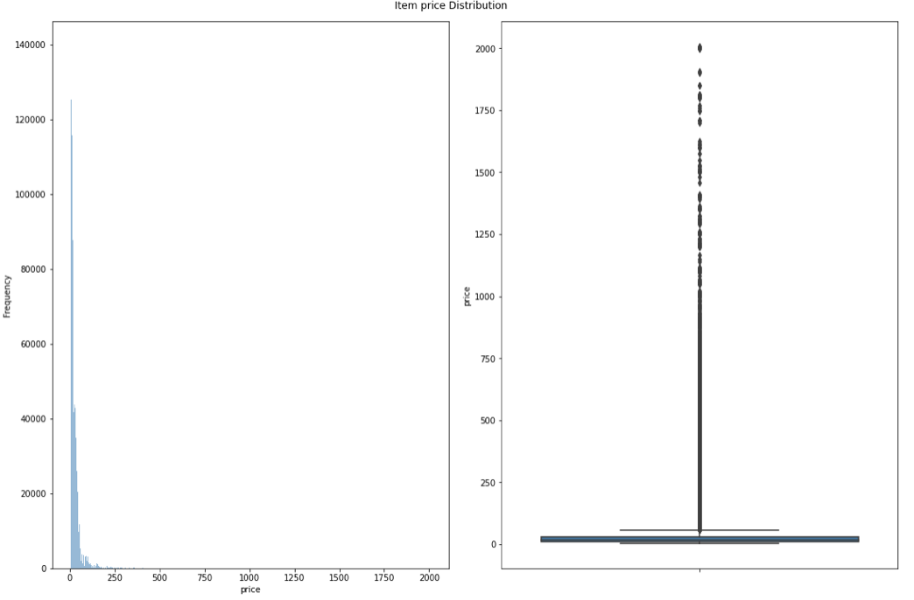

Since price is our target value, we should not remove any item even if it is an outlier of our dataset. To minimize
the effect from the outlier price, we applied logarithmic to transform the price into log price. As show on the below 
figure, the price are more evenly distribute in the logarithmic scale.
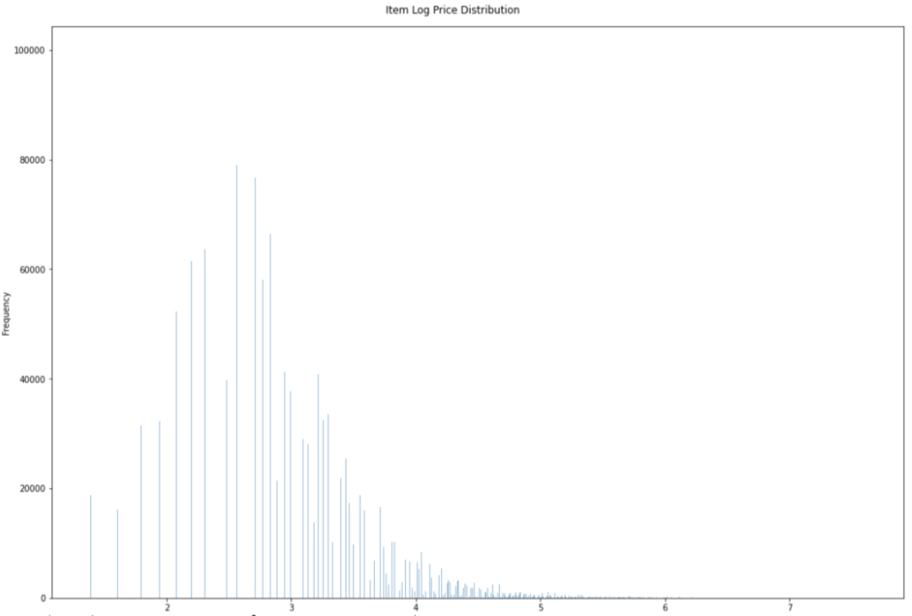

We also check for the missing data in the dataset, in which we found there are over 600,000 missing values in brand name,
and 6327 missing values in category names, and 4 missing values in item description. We don't want to drop records with 
missing values due to two main reasons. First, we don't have many information for each item, and to help the machine learning 
algorithm better learn the pattern for price, we need to provide as many samples as possible or else we will loss too many data if 
we decide to drop it. Second, the missing data could also provide us some meaningful information, such as why they are missing.
We always examine the distribution of the these attributes before we decide on the method to handle these missing values, for example replacing by the most frequent term or replacing missing item with certain fixed value, 

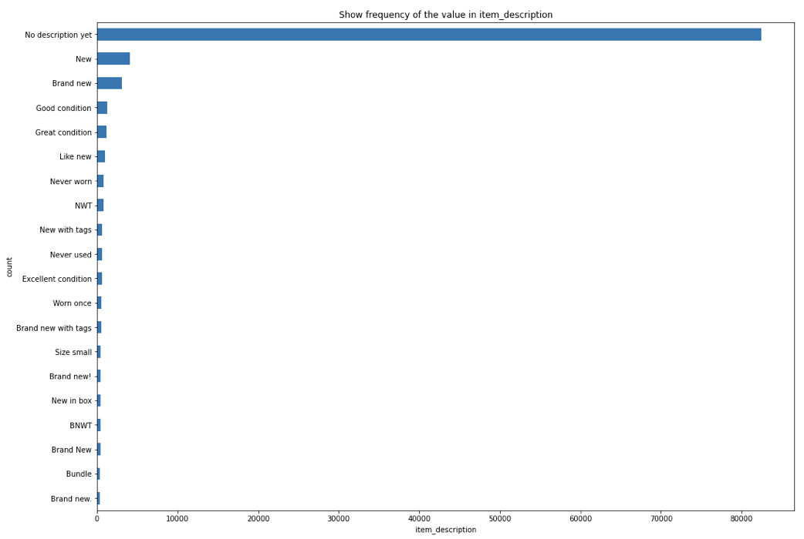

For brand name and category name, we cannot replace by the most frequent term, because number of missing values is  much 
greater than the occurrence of the most frequent term. We decide to replace the missing value with word `missing`, so it will 
be treat as a new category. For item description, we find out the most frequent term is `No description yet`, which have 
over 80,000 occurrences, and we used that value to replace the 4 items with missing item description. Moreover, we 
suspected that there will a low accuracies in other final price prediction result. This is because, item description is 
most valuable information of the item based on our hypothesis, but with over 80,000 items without description, and many
of them are just simple words like `new`, `brand new`, and `good condition`, which don't really provide meaningful
information for predicting price.  

One thing we did is to split the `category name` into 3 columns `c1`, `c2`, `c3`, as the category name is combination
of multi-level category delimited with `/`. Similiar, any missing value with this 3 synthetic categories will be replace by the word 
`missing`. Below is an example of the distribution of the main item category `c1`.

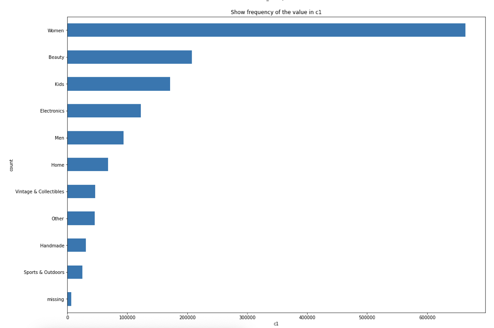

Our dataset do not require any specific code for formatting the data, all of the needed information and numbers are
from the provided dataset. Also, there are no measurement units, such as lbs, kgs, meters, etc. in dataset, so we don't need to 
check for any units and we do not applied normalization for each numerical attributes. We also visualization the distribution of the price.

### Data Transformation - Text Cleaning and Information Extraction

For text data, we apply text cleaning and text information extraction as part of our EDA process. Unclean text can bring a lot of trouble in nature language process, so text cleaning is an essential and important step
before doing any feature extraction or vectorization. We have tried several ways to clean the text, and below describe 
the final process for our text cleaning. We built a function called `cleaning_text` which does the following steps in sequence:

1. Standardize all text to its lower case
2. Use the re package to extract only characters and numbers and remove any special characters and emoji
3. Use the NLTK stopwords package to remove stop word and non-alphabetical words
4. Use the WordNetLemmatizer package to reduce word to its root form
5. Use the string package to replace all punctuation by white space

This function takes an input column of a data frame, perform all the five steps mentioned above sequentially, 
and output a cleaner version of the input feature. Note that we originally include a step for spelling correction using 
the `TextBlob` library, but that step take significant time to process, so we have to remove it to increase our time efficiency
as the amount of data we need to process is large.

We also collect some meaning information about the text string before doing the vectorization. In the text-processing stage, 
we lower all uppercased text, remove all stop words, punctuation, and special characters for each of the input features. 
It's possible that any of these feature play a role in predicting price. For example, price may be higher or lower for 
records with more uppercased words or emoji. We do not want to lose any information from the processed text, 
hence before text preprocessing, we want to extract the uppercase counts, lowercase counts, percent of uppercase 
word in the corpus, percent of lowercase word in the corpus, average word length in a corpus, stop words counts, 
punctuation count, and special character count. We built a function called `get_word_count` and `get_special_char_count`
which specifically extracted features mentions above.

1. The get_word_count is performed on the "name", "description", and "c1", "c2", "c3", and "brand_name" attributes of the data.
2. The get_special_char_count is performed on the "name", "item_description" attributes of the data
	
All of these extracted features will feed into the feature selection model as additional distinct features.

Data normalization is performed on both categorical and vectorized text columns. Min-Max normalization is performed on all original as well as extracted numerical attributes from the dataset except the train_id, item_condition_id, price, and shipping columns. If the difference of max and min is zero, then we drop that column, since those that become zero after normalization are meaningless features. For now, we only evaluate the model where we normalize all data before inputting to the training model. We will be conducting future analysis to look at whether removal of the data normalization step has any improvement on our model performance. 

### Visualization

As some of the figures we show above, there are box plots for detecting the outliers for each numerical attributes.
As well as the histograms to show the distribution of each numerical attributes.
For each categorical attribute, we also show the distribution of the log price for most frequent categories. Note that
there are **4792** unique brands, **11** unique main category `c1`, **105** unique subcategory `c2` and **664** unique 
subcategory `c3`.

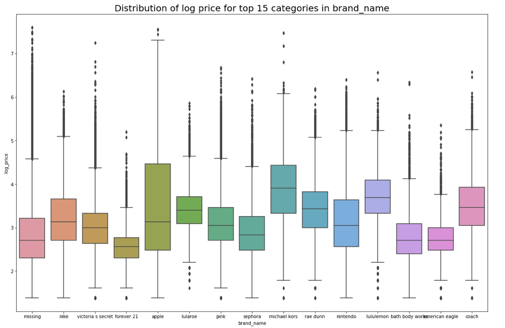

We also consider correlations between existing attributes and generated attributes from text information feature extraction as described above. Since, we have over 40 different attributes, it is hard to display all the correlation in a single correctional matrix, therefore we split the correlation chart into 4 parts and include the price attribute in each sets before computing the correlation coefficients. Below is one of the correlation matrix.

We examine the correlation coefficients for each variable with the price, and find that the highest correlation coefficient
is below 0.2, so there is really no significant correlation between price and any other attributes. So the question for us becomes: how
do we determine the item price from these uncorrelated values using machine learning algorithms.

Here is the scatterplot of the attributes with top 10 correlation coefficient with the price.

#### Summary of EDA
In summary of the data pre-processing, we transform, normalize and filter the data appropriately during our Exploratory Data Analysis (EDA) process before solving our problem. In our "price" attribute, we have data where price is less than or equal to $0, which we filter out during our data cleaning process. We specifically select "price" where it's above 0 dollar. In addition, we also impute the missing value appropriately by replacing the missing values with either with "missing" for the brand and category_name attributes or "no description yet" for the item_description attribute. A series of steps are being applied to all string attributes to clean the text data. 

## Transformation, Feature Selection, and Modeling

### Text Vectorization
In the text feature extraction stage, because the "brand_name" and the three item subcategories (c1,c2,c3) 
are encoded categorically. Before feeding them into our feature selection model, we performed `CountVectorizer` 
for feature extraction. Originally, we try the one-hot encoder, but it returns over 6000 features for these four
categories, which are too many for our model and hard for us to fit into the algorithm with large dataset due to 
the memory limitation of our computers. Therefore, we used `CountVectorizer` for the feature extraction that only
give us around 1200 features but preserve similar information. 

The name and item_description attributes of our dataset contain a bulk of text strings. In order to extract salient features from these two columns, we use the `TfidfVectorizer` from the Sklearn package to perform text feature extraction. We limit the maximum features to be 15,000 for attribute with higher than 
15,000 features. We remove the maximum feature limit for attributes with lower than 15,000 features and take however many features we are able to extract from that attribute.

Note that, before we decide to use the `TfidfVectorizer` as our final method to process the string value to numerical value, we also try [multiple methods](./experiment/feature_extraction/FeatureExtraction_ItemName_E3.ipynb), such as `TfidfVectorizer`,`HashingVectorizer`, `Word2Vec`, `Doc2Vec` methods. You can view all the experiments in [experiment/feature_extraction](./experiment/feature_extraction) folder.

### Dimension Reduction vs Feature Selection
After text feature extractions, we have a total of **18,980** features after combine all features as described below. 
- Size of vectorization features of c1 is 12
- Size of vectorization features of c2 is 106
- Size of vectorization features of c3 is 379
- Size of vectorization features of brand_name is 726
- Size of vectorization features of clean_name is 3629
- Size of vectorization features of clean_description is 15000
- Size of other features is 38

As we face the dimensionality problem given the exorbitant number of features, and we have two ways to reduce the dimension, one is to use the dimension reduction
techniques and the another is to use feature selection techniques; we try both of them.
 
The various [dimension reduction methods](./experiment/feature_extraction/FeatureExtraction_ItemDescription_Jin_E2.ipynb) 
we try include Principal Component Analysis (PCA), singular value decomposition (SVD), k-means clustering and 
Latent Dirichlet Allocation (LDA). Noted that for PCA, we also use eigenvalues and plotted the percent explained ratio 
graph to look for the elbow position when selecting the most optimal number of principal componenents to use for the model. 
We used t-SNE to reduce to 2 dimension and visualization it with color code for different attributes we want to see. 
You can see more experiments we tried in the [experiment/feature_extraction](./experiment/feature_extraction) folder.

We also tried two different feature selections models before feeding data into our training model. 
First is the univaritate feature selection model, [SelectKBest](https://scikit-learn.org/stable/modules/generated/sklearn.feature_selection.SelectKBest.html). 
This model selects the best features based on univariate statistical tests and use the F-value between target and feature for ranking.
We select the F-value as our scoring function, because we are doing regression.
 
We also try the [Recursive feature elimination (RFE)](https://scikit-learn.org/stable/modules/generated/sklearn.feature_selection.RFE.html#sklearn.feature_selection.RFE). RFE is a backward feature selection technique, that considering smaller and smaller groups of features by initial use all features to fit the model, and then sequentially kicks out features with the least weight. 
At each iteration, our RFE removes 5% of the features with lowest score. We choose to use Ridge as the external estimator that assigns weights to each features. This is because, it is efficient and simple, and it also provide good results for small dataset from our experiment.  

### Model Selection
We choose two simple models as our basic model, KNN regressor and Ridge. We selected KNN regressor as it is simple and is a non-parametric model. Another reason for why we select KNN is that we want to see if data with similar value tend to have similar price. We also select ridge regression as it is linear parametric model and we can tune the regression parameters. Moreover, we discard the linear regression model, because from our experiment, it predict negative price for some of the item, which is bad to use as a price prediction model.

We also have two ensemble models as more complex model, lightGBM regressor and  Random forest regressor. LightBGM regressor is a gradient boosting algorithm where the previous model sets the target outcomes for the next model in order to minimize the error. While random forest regressor is a series of independent decision trees for predicting the target outcomes. It would be a great comparison to see whether the combination of independent models or the correlated
model results in better predictions. For example, the following figure shows the comparison of [selected models](./experiment/Feature_Selection_Regression_Model_for_Predict_Price/different_models.png).

In addition to these traditional models, we also built our own [neural network models](./final/model_evaluation/keras_model.py) using **keras** with customized layers to predict the price. As shown in the below figure, the results are relatively good compared to most models, and are almost as good as Random Forest (as also shown below). However, it is hard to fine tune the neural network model and get meaningful and reasonable parameters at this phase.

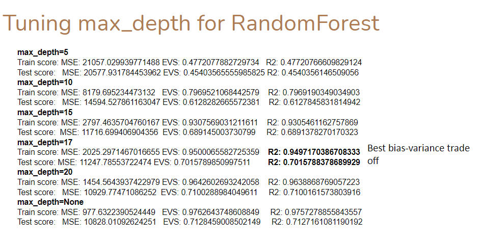

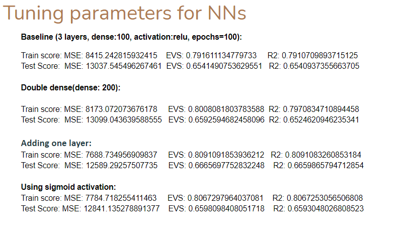

There are [other models](./experiment/Feature_Selection_Regression_Model_for_Predict_Price) we have tried as experiments but are not listed here.  

### Hyperparameter Tuning

Hyperparameter has a large impact in the model prediction result, and it is critical for selecting appropriated value for each hyperparameter in the model. To do that, we have create a class called [`CV_Model`](./final/hyperparameter_tuning/search_cv.py) to allow us to do either RandomizedSearchCV or GridSearchCV to look for the best hyperparameter values for each of our experimented models.

Again, we have a large dataset, so it is impossible for us to do the hyperparameter tuning with entire dataset. So instead, we do the hyperparameter tuning with sample dataset of 10,000 samples. The detail of the sampling process is described in later section. We did a 70-30% train test split for the sample data, 
you can see the result in the [Price Prediction](./experiment/PricePrediction) folder.

Noted that, we selected RandomizedSearchCV for the hyperparameter tuning due to the limitation of computer process power and time. We try the hyperparameter tuning on both the dimension reduction result, feature selection result, and all data before dimension reduction. Below figure show the experiment hyperparameters
we selected for each model. 

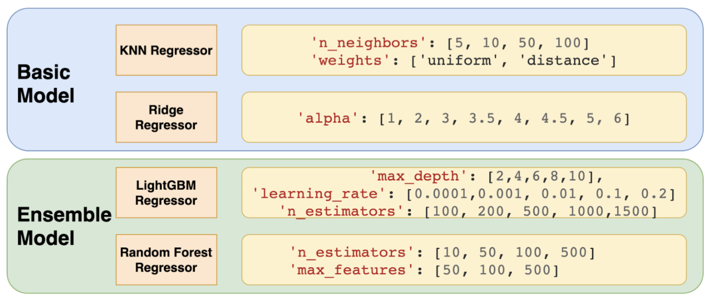

We performed cross-validation and optimize our choice of parameter using RandomizedSearchCV during our hyperparameter tuning stage. Then we use the resulted best hyperparameter to train the larger training set.

- For our KNN regressor model, we use RandomizedSearchCV to get the most optimal `n_neighbors` and `weights`. 
- For our Ridge regressor model, we use  RandomizedSearchCV to get the best `alpha`. 
- For our LightGBM regressor model, we use  RandomizedSearchCV to get the best `max_depth`, `learning_rate`, and `n_estimators`. 
- For our Random Forest regressor model, we use  RandomizedSearchCV to get the best `n_estimators` and `max_features`. 

## Metrics, Validation and Evaluation

In a classification task that aims to determine if the input information is true or false, let's say if 98% of the collected input being true due to data imbalance, then for a model that always predicts true for any input will have 98% accuracy. Even though the model accuracy is super high, it still does not make it a good model because it can never detect false information. Hence accuracy is not a good metric in this case for model evaluation. This kind of model is usually caused by the highly imbalanced data. Therefore, it is important to have evenly distributed dataset, as well as good model evaluation metric.

### Data Sampling

We have 5 different data sampling methods generated (with sampling replacement if needed) to produce an even distribution for brand name, item category (3 different level), price (separate into bins). Noted that the price is our target and is a continuous variable, so to allow for an even distribution of price,
we separate price into uniform size bins because price has a skewed distribution. The detail of the sampling steps
can be seen in [random sampling](./final/random_sampling) folder.

We also have classification experiment for the data samples show in the [classification](./experiment/classification) folder for each category we select for the sampling techniques.

### Evaluation Metrics

Our main evaluation metrics is **RMSLE**, which stands for Root Mean Squared Logarithmic Error.  Because our price distribution is skewed and impacted by outliers and RMSLE is very robust to eliminate the effect from outliers. Hence, RMSLE is our main evaluation metrics. We also evaluated the model using other metrics, but since this metrics highly impact by the outliers, it will not be used as metrics for the hyperparameter tuning. 

These additional metrics include:
1. Mean Absolute Percentage Error (MAPE) for analyze the percentage difference for the prediction price and original price
2. Mean Absolute Error (MAE) for analyze how much the predict price is off from the original price
3. R Square (R^2) for analyze how model fits the input dependent variables
4. Maximum percentage difference between predict  price  and original price 

All metrics are being evaluated for the model at the end. 

### Result
We did a train-test split before text vectorization, feature selection, hyperparameter tuning, and model training. Because we only feed the training data into the training model, we are sure that there is no information leak in our model and that our model has not seen the test dataset before making the prediction on the test set. 

Here are results of model using best hyperparameter from the hyperparameter tuning result.
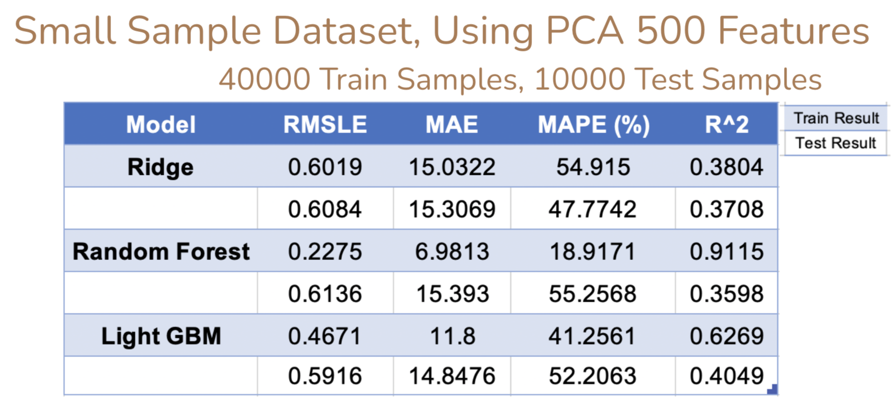
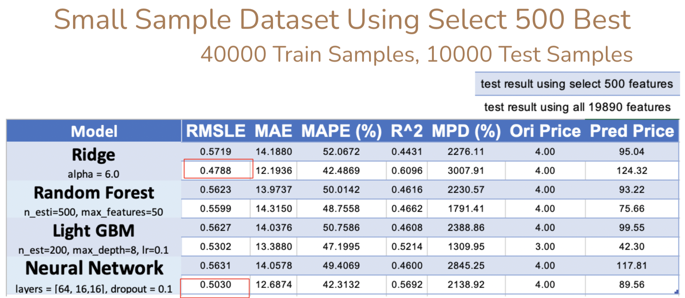

What we learn from the experiment is that the feature selection is better than dimension reduction for our features, based on the above two result table, we can see that feature selection (Select 500 Best features) having a better performance and metrics in all model than the ones resulted from the dimension reduction (PCA) technique. 

Within feature selection methods, [SelectKBest](https://scikit-learn.org/stable/modules/generated/sklearn.feature_selection.SelectKBest.html) method also outperformed the [Recursive feature elimination (RFE)](https://scikit-learn.org/stable/modules/generated/sklearn.feature_selection.RFE.html#sklearn.feature_selection.RFE),
you can see the result in [Price Prediction](./experiment/PricePrediction) experiment folder.

Moreover, the model trained with all features performs better than the one trained with select features. Also the Ridge model is the best model for the small sampling dataset with train using all features, it has RMSLE of `0.4788`. Although the neural network has higher RMSLE, it has lower MAPE than that of Ridge, meaning neural network has a smaller the percentage difference between predicted and actual price than that of Ridge.

But in the larger sampling dataset, Ridge is the worse model in compare with other models. This is because Ridge cannot capture the generalized pattern of the larger dataset given its model simplicity. But without doubt, larger sample dataset tends to lower the MAE. 

Random forest regressor is the best model than the traditional models we use for price prediction. Even though random forest regressor has the same RMSLE as the larger neural network, the larger neural network has a lower MAE than random forest regressor. You can also see value of the Maximum Percentage Difference (MPD) between the predicted price and the original price, in which you can really see the impact of outliers on the MAPE value. This further solidifies our previous statement that MAPE cannot be used as our main evaluation metric for the model as it is highly affected by outliers.  

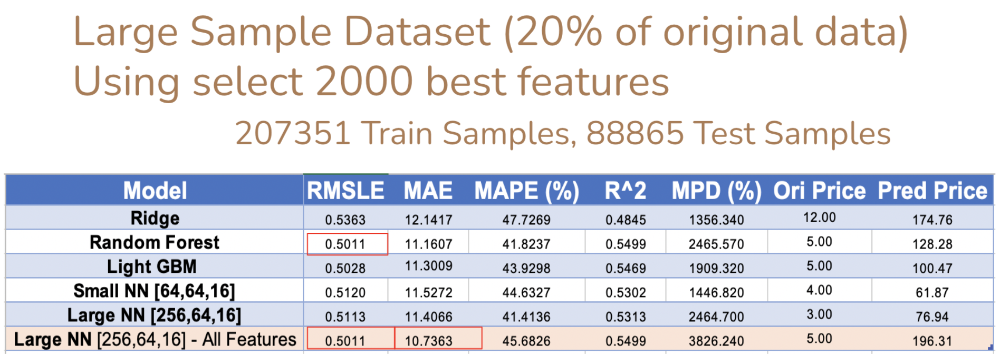

We also explore and evaluate on different price range, you can see more result from the [Price_Prediction_Large_Sample.ipynb](./Price_Prediction_Large_Sample.ipynb)

## Conclusion and Future Work
There are several conclusions can be drawn in our project:
1. Transforming the price to log scale can reduce the effect on the price outlier thus provide better prediction result.
2. SelectKBest is better than RFE in price prediction and more efficient.
3. Feature selection technique is more suitable than the dimension reduction technique for our dataset in terms of eliminating the number of input features for the model.
4. Models with all Features perform better than those trained with select features.
5. Ridge is optimal for dealing with smaller dataset but not for large dataset.
6. More training samples and more training features allow model to perform better in price prediction for an item. 
7. Ensembele learning such as Random Forest generally performs as well as Neural Network. However, Random Forest is more likely to be overfitting but with higher goodness of fit in testing set. Rather, Neural Network requires more in-depth expertise knowledge so as to reach its full potential. 

In conclusion, our pipeline is able to suggest a price range within $10 error for any item in the Mercari Marketplace with any given item information. The item information can have missing or limited information on its brand name, item description, or item categories. 

However, our final model is not the best model and there are many areas for improvement. One possibility for such improvements is to combine the category name, brand name with the item name before feature extraction to remove some unnecessary features while maintaining the more meaningful features for the model. Another possibility is to try different word embedding techniques. 

Definitely there are also some limitations in project which prevents us from getting better and more meaningful results. These limitation include:
1. Limited computer memory and process power, which makes training models on a large data with a lot of features difficult.
2. A few of data attributes that comes with the collected data contain many missing values. It will be interesting if we have other complementary data, such as the item rating and number of item views, and so together we can see how they all affect pricing. 
3. A long computation time for model trainings, so it's difficult or almost impossible to perform all the experiments that we want given our project time constraints, as Jupyter notebook constantly asks to reload the data and the data easily get lost in this way. 
