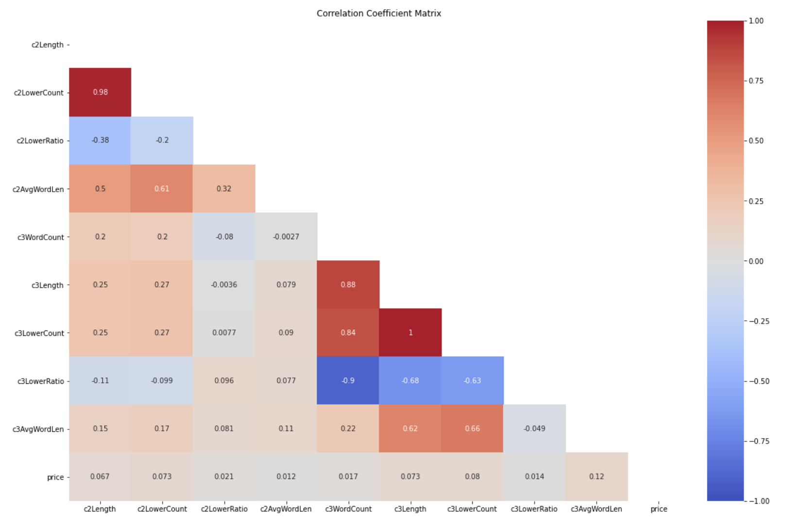
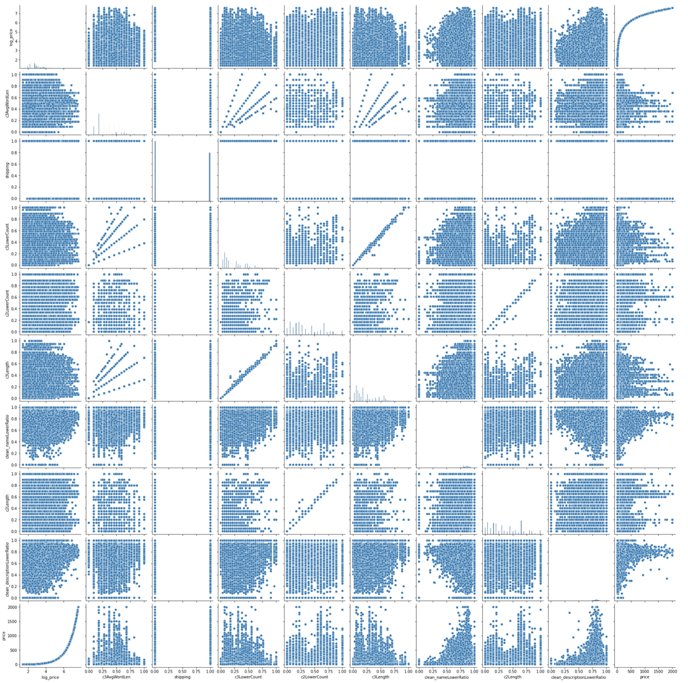

# Product-Price-Prediction
**Team Members:** Jin Chen, Zhi Li, Juliana Ma, Zhiying Zhu

## **Motivation and Problem Description** 

As a person just entering the retail industry, how can they quickly learn about the market? 
How could they scale a good price for their product? If they price too high, people will not pay for it, 
but if they price too low, people could either question about their product or they will not have enough profit. 
Beside the retail person, the business owner also have the need for understanding the market, to know how their 
competitors pricing the similar product, and use that information to do their business strategies planning. 
So the main question here is what affect the product price and how could we determine the best price range for a product 
so it will not off from the exist market. 

There are many common senses on the things that could affect the price, such as clothes price can vary by the season and 
the brand, even the descriptions of the products can also cause fluctuating prices. 
To better understand these question and explore the answer, we look into the dataset provide by [Mercari](https://www.mercari.com),  
Japan’s biggest community-powered shopping app. The dataset contains over 1.4 millions of product records, where each records 
consists the seller inputted information of the product they are selling, including the item name, item conditions, 
brand name, item categories, shipping status, and item descriptions. 
It is a great dataset for us to explore the potential answers to our question, for many reasons. 
First, online selling is more demand in today's world and sellers not only sell the new product but also 
the remanufactured product or second-hand product, and this dataset could the product from a large diverse range. 
Second, the sellers from the Mercari, range from individuals just enter the retail field to experience business, 
so we can have a more general analysis of the market.
Third, the dataset contained large number of records that can provide a great representative overview of the market. 

Based on the dataset, we would like to know if the item desciption and other fields that dataset provided can really 
help people determine the price range of the product, and if so, how accurate that predict price range will be. 
To find the answer for our problem, we explore different data process and analysis algorithm and machine learning models 
to build the pipeline for our price prediction. The general pipeline of our process is show in the below figure, where the
color of each components reflect on the works of each team member. 

## Data Exploration and Preprocessing

None of the raw data is clean and in order to get meaningful insight from the dataset, we need perform a series of steps 
for data cleaning and pre-processing. The full process for our EDA process is show in the [EDA_Process.ipynb](./EDA_Process.ipynb).  

As the data collected from seller manual input, there are possibilities of wrong information in the dataset. We applied
some logic to detect and remove the wrong records. For example, we have found 874 records with price less or equal to 
0, which we remove from dataset, because price cannot never be a negative value or 0. 

From the 8 attributes the dataset provide, train_id cannot be used so ignore that attributes. Shipping condition and item 
condition is integer categorical values, and other attributes besides prices are string attributes, so only column we need 
to look for outliers is the price attibutes. Below is the plot that shows distribution of the price column with 
both box plot and histogram. For histogram, you can see the distribution is heavily left skew. 
Outliers can also be easily see from the box plot. Note, we have this kinder of visualization for all the 
numerical attributes show in the [EDA_Process.ipynb](./EDA_Process.ipynb) to help us detect for outliers.

Since price is our target value, we should not remove any item if its price is an outlier of our dataset. To minimize
the effect from the outlier price, we applied logarithmic to transform the price into log price. As show on the below 
figure, the price are more evenly distribute in the logarithmic scale.

We also check for the missing data in the dataset, in which we found there are over 600,000 missing values in brand name,
and 6327 missing values in category names, and 4 missing values in item description. We don't want to drop records with 
missing values due to 2 reasons. First, we don't have many information for each item, and so to help the machine learning 
algorithm better learn the pattern for price is then provide as many samples as possible. We will loss too many data, if 
we decide to drop it. Second, the missing data could also provide us some meaningful information, such as why they are missing.
Before, we decide how to handle this missing value, such as replace by the most frequent term, we look over the distribution
of the these attributes.

For brand name and category name, we cannot replace by the most frequent term, because number of missing values is  much 
greater the occurrences of the most frequent term. We decide to replace the missing value with word `missing`, so it will 
be treat as a new category. For item description, we find out the most frequent term is `No description yet`, which have 
over 80,000 occurrences, and we used that value to replace the 4 items with missing item description. Moreover, we 
suspected that there will a low accuracies in other final price prediction result. This is because, item description is 
most valuable information of the item based on our hypothesis, but with over 80,000 items without description, and many
of the description is just simple words like `new`, `brand new`, and `good condition`, which don't really provide meaningful
information for predict the price.  

One thing we did is to split the `category name` into 3 columns `c1`, `c2`, `c3`, as the category name is combination
of multi-level category with `/`. Similiar, any missing value with this 3 generate categories will be replace by the word 
`missing`. Below is an example of the distribution of the main item category `c1`.

Our dataset don't require any specific code for formatting the data, all the needed information and numbers are gotten 
from the provided dataset. Also, there are not measurement units, such as lbs, kgs, meters, etc. in dataset, so we don't need to 
check for any units, but we don't applied normalization for each numerical attributes. 
We also visualization the distribution of the price.

#### Data Transformation - Text Cleaning and Feature Extraction

For text data, we apply text cleaning, text feature extraction, and text vectorization as part of our EDA process. 

Unclean text can bring a lot of trouble in nature language process, so text cleaning is an essential and important step
before doing any feature extraction or vectorization. We have tried several ways to clean the text, and below describe 
the final process for our text cleaning. We built a function called `cleaning_text` which does the following steps in sequence:

1. Standardize all text to its lower case
2. Use the re package to extract only characters and numbers and remove any special characters and emoji
3. Use the NLTK stopwords package to remove stop word and non-alphabetical words
4. Use the WordNetLemmatizer package to reduce word to its root form
5. Use the string package to replace all punctuation by white space

This function takes an input column of a data frame, perform all the five steps mentioned above sequentially, 
and output a cleaner version of the input feature. Note that we originally include a step for spelling correction using 
the `TextBlob` library, but that step take significant time to process, so we have remove it to increase our time efficiency
as the amount of data we need to process is large!

We also collect some meaning information about the text string before doing the vectorization. In the text-processing stage, 
we lower all uppercased text, remove all stop words, punctuation, and special characters for each of the input features. 
It's possible that any of these feature play a role in predicting price. For example, price may be higher or lower for 
records with more uppercased words or emoji. We do not want to lose any information from the processed text, 
hence before text preprocessing, we want to extract the uppercase counts, lowercase counts, percent of uppercase 
word in the corpus, percent of lowercase word in the corpus, average word length in a corpus, stop words counts, 
punctuation count, and special character count. We built a function called `get_word_count` and `get_special_char_count`
which specifically extracted features mentions above.

1. The get_word_count is performed on the "name", "description", and "c1", "c2", "c3", and "brand_name" attributes of the data.
2. The get_special_char_count is performed on the "name", "item_description" attributes of the data
	
All of these extracted features will feed into the feature selection model as additional distinct features.

In the text feature extraction stage, because the "brand_name" and the three item subcategories (c1,c2,c3) 
are encoded categorically. Before feeding them into our feature selection model, we performed CountVectorizer 
for feature extraction. The name and item_description attributes of our dataset contain a bulk of text strings. 
In order to extract salient features from these two columns, we use the TfidfVectorizer from the Sklearn package 
to perform text feature extraction. We limited the maximum features to be 15,000 for attribute with higher than 
15,000 features. We remove the maximum feature limit for attributes with lower than 15,000 features and take 
however many features we are able to extract from that attribute.

Note that, before we decide to use the `TfidfVectorizer` as our final method to process the string value to numerical value,
we have tried [multiple methods](./experiment/feature_extraction/FeatureExtraction_ItemName_E3.ipynb), such as 
`TfidfVectorizer`,`HashingVectorizer`, `Word2Vec`, `Doc2Vec` methods. You can view all
the experiements in [experiment/feature_extraction](./experiment/feature_extraction) folders.

Data normalization is performed on both categorical and vectorized text columns. 
Min-Max normalization is performed on all original as well as extracted numerical attributes from the 
dataset except the train_id, item_condition_id, price, and shipping columns. If the difference of max and min 
is zero, then we drop that column, since that are fill with value of 0 which are meaningless.

#### Visualization

As some of the figures that show before, there are box plots for detecting the outliers for each numerical attributes.
As well as the histograms to show the distribution of each numerical attributes.
For each categorical attribute, we also show the distribution of the log price for most frequent categories. Note that
there are **4792** unique brands, **11** unique main category `c1`, **105** unique subcategory `c2` and **664** unique 
subcategory `c3`.

We also consider correlations between exist attributes and generated attributes from text information feature extraction
as described above. Since, we have over 40 different attributes, it is hard to display all the correlation in a single
correctional matrix, so instead split into 4 sets, in which price attribute is in each sets and then we compute for
the correlation coefficients. Below is one of the correlation matrix.

We examine the correlation coefficients for each variable with the price, and find that the highest correlation coefficient
is below 0.2, so there is no meaningful correlation between price and any other attributes. So the question for us, it how
do we determine the item price from these uncorrelated values using the machine learning algorithm.

Here is the scatterplot of the attributes with top 10 correlation coefficient with the price.

##### Summary of EDA
In summary of the data pre-processing, we transform, normalize and filter the data appropriately during our 
Exploratory Data Analaysis (EDA) process before solving our problem. In our "price" attribute, we have data where prices 
were reported less than $0, which are being filtered out during our data cleaning process. 
We specifically select "price" where it's above 0 dollar. In addition, we also impute the missing value appropriately 
by replacing the missing values with either 
with "missing" for the brand and category_name attributes or "no description yet" for the item_description attribute. 
A series of steps are being applied to all string attributes to clean the text data, then cleaning text data are input
into vectorizers to transform into appropriated numerical values.
